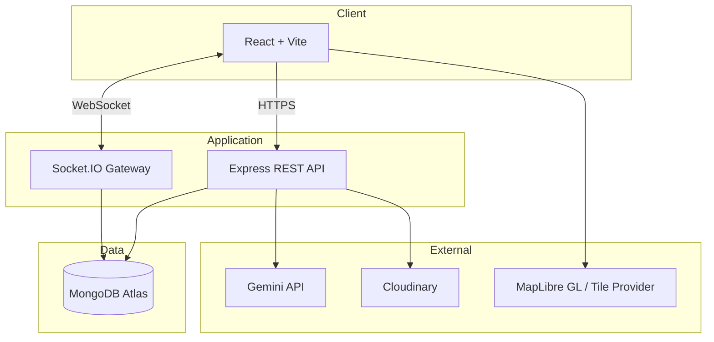

<div align="center">

<h1>Relay</h1>

<p><strong>No valuable resource should end unused.</strong></p>

[](https://github.com/TheLucifer-07/Relay/stargazers)
[](#technology)
[](#technology)
[](#getting-started)
[](#contributing)

<a href="https://relay-community-one.vercel.app"><strong>Live Demo</strong></a> &nbsp;•&nbsp;
<a href="#getting-started">Documentation</a> &nbsp;•&nbsp;
<a href="https://github.com/TheLucifer-07/Relay">GitHub</a>

<br />

`React` `Vite` `Tailwind CSS` `Node.js` `Express` `MongoDB` `Socket.IO` `MapLibre GL` `Gemini` `Cloudinary`

</div>

---

<div align="center">

*Somewhere near you, someone already owns the thing you're about to buy new.*
*Relay is how you find them.*

</div>

---

## Vision

There is a version of the economy that never shows up in any app, any listing, any search result.

It's the drill in a garage that's been used twice. The paperback finished in a weekend and never opened again. The gift card sitting in an inbox, worth real money, spent by no one. Not waste — just value that stopped moving.

**Relay exists to build the exchange layer for that economy.** An AI-powered network where the things people already own — books, gift cards, tools, electronics — find their way to the people nearby who actually need them, without a single new purchase in between.

---

## The Hidden Economy

Every home is quietly running its own small, invisible economy — and almost nobody is looking at it.

A book, read once, shelved forever. A gift card with a balance nobody remembers logging in to check. A power drill, borrowed for one Saturday project, that's been sitting in a cupboard ever since. An old phone, three generations out of date, still perfectly capable of a second life in someone else's hands.

None of this is being tracked, priced, or moved. It just sits — in garages, in drawers, in inboxes — while somewhere close by, someone is opening a new browser tab to buy the exact same thing.

That gap is the whole opportunity. Not because people are careless, but because the two things exchange actually requires — **knowing what's nearby**, and **trusting the person who has it** — have never had good tooling built around them. Classifieds group, but sell. Marketplaces list, but don't exchange. Nothing was built to notice that value is *already* out there, sitting still.

Relay was built to notice it.

---

## The Problem

Marketplaces built for buying and selling don't solve this — because they were never designed to.

<table>
<tr>
<td width="50%" valign="top">

**Unused resources are invisible**

There's no shared view of what a community already owns — so demand and supply for the same item can sit two houses apart and never meet.

</td>
<td width="50%" valign="top">

**Listings are manual and inconsistent**

Writing a good description, picking a category, and estimating a fair value all fall entirely on whoever is listing — which is exactly where most listings quietly die.

</td>
</tr>
<tr>
<td width="50%" valign="top">

**Trust doesn't scale on classifieds**

Anonymous posts and cash handoffs make peer-to-peer exchange feel riskier than it should, especially between two people who've never met.

</td>
<td width="50%" valign="top">

**Negotiation has no structure**

A DM thread isn't a negotiation system. There's no offer state, no history, no resolution — just messages, scrolling upward, with no shared sense of where a trade actually stands.

</td>
</tr>
</table>

The result is a quiet, systemic mismatch: value sitting idle on one side, unnecessary purchases happening on the other, and no reliable bridge connecting them.

---

## The Relay Philosophy

Relay treats exchange as a **product problem**, not a listings problem. Four ideas run underneath everything it does.

<table>
<tr>
<td width="50%" valign="top">

### AI removes the friction of listing

Gemini looks at a resource and handles the category, the estimated value, and the description — the three decisions that make people abandon a listing halfway through. The blank page disappears before it becomes a reason to quit.

</td>
<td width="50%" valign="top">

### Structure replaces ad-hoc messaging

Every negotiation moves through a defined offer-and-response flow, so both sides always know exactly where a trade stands — no guessing, no re-reading a message thread to reconstruct what was actually agreed to.

</td>
</tr>
<tr>
<td width="50%" valign="top">

### Trust is earned, not assumed

Reviews, achievements, and a composite trust score turn a trader's history into something visible and verifiable, so meeting a stranger to exchange something valuable stops being a leap of faith.

</td>
<td width="50%" valign="top">

### Proximity is a first-class input

Discovery and handoff scheduling are both built around real-world location — because an exchange, unlike a shipment, only works if two people can actually meet.

</td>
</tr>
</table>

---

## Why Exchange Beats Buying

Buying is fast, predictable, and doesn't require trusting a stranger. That's precisely why it's the default — and precisely why it manufactures new demand for things that already exist, sitting idle, somewhere nearby.

Relay is built on the bet that if discovery and trust are solved well enough, exchanging stops being the harder option. It becomes the obvious one.

| | Traditional marketplaces | **Relay** |
|---|---|---|
| Core transaction | Cash-based buying and selling | Structured resource-for-resource exchange |
| Listing creation | Fully manual | AI-assisted category, value, and description |
| Trust | Informal, unverifiable | Trust score, reviews, achievements |
| Negotiation | Unstructured messaging | Defined offer and acceptance flow |
| Design intent | More transactions | More reuse, fewer new purchases |

That last row is the point. Relay isn't optimizing for volume. It's optimizing for the thing volume usually works against — resources that were already sitting somewhere, finally moving again.

---

## Feature Showcase

### Discovery & Exchange
*Finding what's already nearby, and turning it into an actual trade.*

AI-assisted listing generation removes the blank-page problem at the exact point people give up. From there, a marketplace with both map and list views, plus nearby resource discovery, surfaces what's actually close enough to exchange in person — while trade requests, structured offers, live auctions, and bookmarks give people the tools to act on what they find.

| Capability | What it does |
|---|---|
| AI-assisted listing generation | Gemini drafts the category, value estimate, and description from the resource itself |
| Marketplace (map + list views) | Browse available resources spatially or as a straightforward list |
| Nearby resource discovery | Surfaces what's actually close enough to exchange in person |
| Trade requests & structured offers | Turns interest into a defined, trackable negotiation |
| Live auctions | Time-boxed, competitive exchange for higher-demand resources |
| Bookmarks | Save resources of interest without committing to a trade yet |

### Trust & Community
*Turning a trader's history into something you can actually see.*

Public trader profiles, trust scores, reviews, and achievements replace the anonymous, unverifiable identity of a typical classifieds post with a visible track record — so agreeing to meet a stranger stops feeling like a leap of faith. Real-time notifications keep that trust current by surfacing what's happening the moment it happens.

| Capability | What it does |
|---|---|
| Public trader profiles | A visible identity and history behind every trade |
| Trust scores | A composite signal built from a trader's track record |
| Reviews | Direct feedback from completed exchanges |
| Achievements | Recognition for consistent, reliable trading behavior |
| Real-time notifications | Immediate visibility into offers, messages, and trade status changes |

### Negotiation & Communication
*A real conversation, not a message thread with no memory.*

Real-time messaging over Socket.IO, live typing indicators and status, and a persistent conversation history scoped to each individual trade mean negotiation actually feels immediate — and nothing about where a trade stands gets lost by scrolling back through a feed.

| Capability | What it does |
|---|---|
| Real-time messaging (Socket.IO) | Instant, two-way communication per trade |
| Typing indicators & live status | Visible signal that the other side is actively engaged |
| Persistent conversation history | Every trade keeps its own complete, retrievable record |

### Logistics
*Getting from "agreed" to an actual handoff.*

A personal resource inventory keeps track of what someone owns and has offered, while handoff scheduling and interactive handoff maps turn "let's meet up" into an actual plan — the step that determines whether an agreed trade becomes a completed one.

| Capability | What it does |
|---|---|
| Personal resource inventory | A trader's full record of owned and offered items |
| Handoff scheduling | Coordinating an actual time to meet |
| Interactive handoff maps | Coordinating an actual place to meet, rendered with MapLibre GL |

---

## Inside Relay

> Screenshots: 1280px wide, 2-up grid. GIFs reserved for Live Map Discovery (pan/cluster) and Messages (typing indicator + live send) — static PNG/WebP everywhere else.

<table>
<tr>
<td width="50%">

**Landing**

The first impression — a calm, uncluttered entry point that makes the idea of Relay legible in seconds, before any sign-up friction.

`[ screenshot ]`

</td>
<td width="50%">

**Marketplace**

Browsing available resources, switchable between a map and a traditional list, filtered by category and proximity.

`[ screenshot ]`

</td>
</tr>
<tr>
<td width="50%">

**Live Map Discovery**

Resources plotted spatially on MapLibre, so "what's near me" is answered visually rather than by scrolling a feed.

`[ gif ]`

</td>
<td width="50%">

**Trade Details**

The single source of truth for a trade — its offer state, history, and current status, all in one place.

`[ screenshot ]`

</td>
</tr>
<tr>
<td width="50%">

**Messages**

Real-time conversation for a specific trade, with typing indicators and a persistent, scoped history.

`[ gif ]`

</td>
<td width="50%">

**Requests**

Incoming and outgoing trade requests, tracked as they move through the offer-and-response flow.

`[ screenshot ]`

</td>
</tr>
<tr>
<td width="50%">

**Auctions**

Live, time-boxed bidding for resources in higher demand.

`[ screenshot ]`

</td>
<td width="50%">

**Public Profile**

A trader's visible track record — trust score, reviews, and achievements, all in one page.

`[ screenshot ]`

</td>
</tr>
<tr>
<td width="50%">

**Dashboard**

A trader's home base — their inventory, active trades, and recent activity in one view.

`[ screenshot ]`

</td>
<td width="50%">

**Notifications**

Real-time visibility into offers, messages, and trade status changes as they happen.

`[ screenshot ]`

</td>
</tr>
</table>

---

## The Trade Lifecycle

A single, consistent path — from finding a resource to a completed, reviewed exchange — with no ambiguity at any step for either trader. "Negotiate" and "Make an Offer" are where the structured offer-and-response flow lives; "Schedule Handoff" is where it becomes a real-world meeting.


Every trade, regardless of what's being exchanged, follows this same shape — which is precisely what makes it possible to always know where things stand.

---

## Architecture



The client speaks to two surfaces: a stateless REST API for standard operations, and a persistent Socket.IO gateway for real-time negotiation. Gemini and Cloudinary sit behind the API rather than being called directly from the client — keeping credentials and rate limits centrally managed, and keeping the client itself simple.

---

## Engineering Decisions

> Why these technologies, specifically — not just what they are.

**React + Vite.** The interface has enough distinct states — marketplace, negotiation, trade timeline, maps — that a component model pays for itself quickly. Vite keeps the feedback loop fast enough that this never slows anyone down.

**Express.** A thin, unopinionated layer over the logic that actually matters: trades, negotiation, and identity. Nothing about this problem needed a heavier framework standing in the way.

**MongoDB.** A book and a power tool don't share a schema, and neither does an electronics listing and a coupon. A document model absorbs that variation without constant migrations every time a new resource type gets added.

**Socket.IO.** Negotiation is a real-time conversation, not a form submission. Polling for new offers would make every trade feel delayed; a persistent connection makes it feel immediate instead.

**Gemini.** The single biggest reason listings don't get created is the blank-page problem — deciding on a category, a fair value, a description. Offloading that to Gemini removes the friction at the exact point people give up.

**MapLibre GL.** Discovery and handoffs are inherently spatial. MapLibre gives that without tying the project to a single paid vendor's map platform.

**Cloudinary.** A resource's photo is the first and strongest trust signal in any exchange. Cloudinary handles optimized delivery so image quality is never a performance trade-off.

---

## Technology

| Layer | Technology |
|---|---|
| Frontend | React 19, Vite 8, Tailwind CSS, Framer Motion, React Router |
| Backend | Node.js, Express.js |
| Database | MongoDB Atlas, Mongoose |
| Realtime | Socket.IO |
| AI | Google Gemini (via `@google/genai`) |
| Maps | MapLibre GL JS |
| Media Storage | Cloudinary |
| Authentication | JWT, bcryptjs |
| Notifications (UI) | Sonner |

---

## Folder Structure

<details>
<summary><strong>View project structure</strong></summary>

```text
Relay/
├── server/
│   ├── config/          Database and environment configuration
│   ├── controllers/     API request handlers
│   ├── middleware/      JWT authentication guards
│   ├── models/          Mongoose schemas
│   ├── routes/          Express route definitions
│   ├── services/        Gemini and Cloudinary integrations
│   ├── socket/          Real-time negotiation handlers
│   └── index.js         Backend entry point
│
├── src/
│   ├── components/
│   │   ├── map/         Discovery and handoff map components (MapLibre)
│   │   ├── trade/       Trade status and timeline UI
│   │   └── ui/          Shared interface components
│   ├── context/         Global application state
│   ├── data/            Categories and demo data
│   ├── lib/             API, auth, and AI client helpers
│   ├── pages/           Application screens
│   ├── routes/          Route definitions
│   ├── utils/           Frontend utilities
│   ├── App.jsx
│   └── main.jsx
│
├── package.json
├── tailwind.config.js
└── vite.config.js
```

> ⚠️ Confirm this matches `git ls-files` on `main` before publishing — verify the `server/` layout directly against the repo.

</details>

---

## Getting Started

**Prerequisites**
- Node.js 20 or later
- A MongoDB Atlas cluster
- API keys for Gemini and Cloudinary

**Setup**
```bash
git clone https://github.com/TheLucifer-07/Relay.git
cd Relay
npm install
cp .env.example .env
```

**Run locally**
```bash
npm run dev:server   # Express API
npm run dev           # Vite frontend — http://localhost:5173
```

**Production build**
```bash
npm run build
npm run preview
```

---

## Environment Variables

| Variable | Purpose | Required |
|---|---|:---:|
| `MONGO_URI` | MongoDB Atlas connection string | Yes |
| `JWT_SECRET` | Signs and verifies authentication tokens | Yes |
| `GEMINI_API_KEY` | Enables AI-assisted listing generation | Yes |
| `CLOUDINARY_CLOUD_NAME` | Cloudinary account identifier | Yes |
| `CLOUDINARY_API_KEY` | Image upload authentication | Yes |
| `CLOUDINARY_API_SECRET` | Signs Cloudinary uploads | Yes |
| `CLIENT_URL` | Configures CORS for the deployed frontend | Yes |
| `PORT` | Backend server port | No |

> Secrets are never committed. `.env.example` documents the required shape; the real `.env` stays local.
> Confirm whether email sending (e.g. Resend) is actually wired into the backend — if so, add its variable here; if not, don't document it.

---

## Live Deployment

| | URL |
|---|---|
| Frontend | [relay-community-one.vercel.app](https://relay-community-one.vercel.app) |
| Backend API | [relay-xi5r.onrender.com](https://relay-xi5r.onrender.com) |
| Source | [github.com/TheLucifer-07/Relay](https://github.com/TheLucifer-07/Relay) |

> The backend runs on Render's free tier — the first request after a period of inactivity may take a few seconds to wake the instance.

---

## Performance

- Vite's native module dev server and optimized production bundling keep both iteration speed and shipped size in check.
- Cloudinary serves responsively transformed images rather than raw uploads, reducing payload on every listing view.
- Mongoose indexes on frequently filtered fields keep marketplace queries fast as listing volume grows.
- Socket.IO events are scoped to individual trade rooms, avoiding unnecessary broadcast overhead across unrelated users.

---

## Security

- JWT-based authentication with bcryptjs password hashing
- Route-level middleware protecting every authenticated endpoint
- Environment-based secret management, excluded from version control
- CORS explicitly scoped to the deployed client origin
- Server-side validation on every write, independent of client-side checks
- Mongoose schema validation and indexing to prevent malformed writes at the database layer

---

## Scalability

- **Stateless API** — Express handlers carry no session state, so scaling horizontally is a matter of adding instances behind a load balancer.
- **Schema flexibility** — MongoDB absorbs new resource categories without downtime or migrations.
- **Isolated realtime layer** — Socket.IO's room model scopes negotiation traffic, allowing it to scale independently of general API load.
- **Offloaded heavy lifting** — Cloudinary and Gemini absorb the most variable workloads, keeping the core API lightweight.

---

## Roadmap

- [ ] Voice-based negotiation
- [ ] AI-driven matchmaking between complementary traders
- [ ] Native mobile applications
- [ ] Offline-first mode for low-connectivity areas
- [ ] Smart locker integration for unattended handoffs
- [ ] Community-wide exchange events
- [ ] Deeper gamification and trader progression
- [ ] Carbon impact tracking per completed exchange
- [ ] Personalized resource recommendation engine

---

## Contributing

Relay is built in the open. Contributions that improve it are welcome.

1. Fork the repository
2. Create a branch — `git checkout -b feature/your-feature`
3. Commit with clear, specific messages
4. Open a pull request describing the change and its motivation

For larger changes, open an issue first to align on direction before the work begins. Small, focused pull requests are reviewed faster than large ones.

---

## Author

<div align="center">

**Hemachandu Animireddy**

[GitHub](https://github.com/TheLucifer-07) &nbsp;•&nbsp;
[LinkedIn](https://www.linkedin.com/in/hemachandu-animireddy/) &nbsp;•&nbsp;
[Email](mailto:hemachanduanimireddy@gmail.com)

Released under the MIT License — see [`LICENSE`](./LICENSE).

</div>

---

<div align="center">

Buying is a way of pretending nothing like what you need already exists.

Relay is built on the opposite assumption — that it does, close by, waiting.

**Technology shouldn't manufacture more demand.**
**It should help what already exists find its way to where it's needed.**

*That's the whole idea behind Relay.*

<br />

[**Try Relay →**](https://relay-community-one.vercel.app) &nbsp;•&nbsp; [**Star the repo →**](https://github.com/TheLucifer-07/Relay)

</div>
